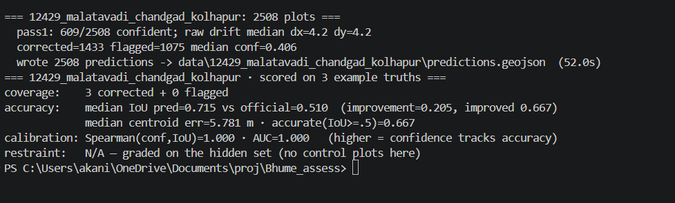
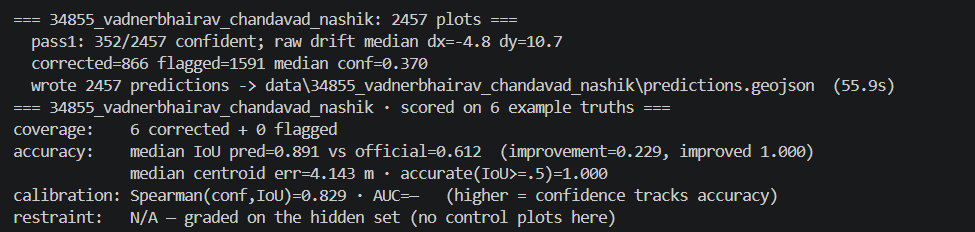
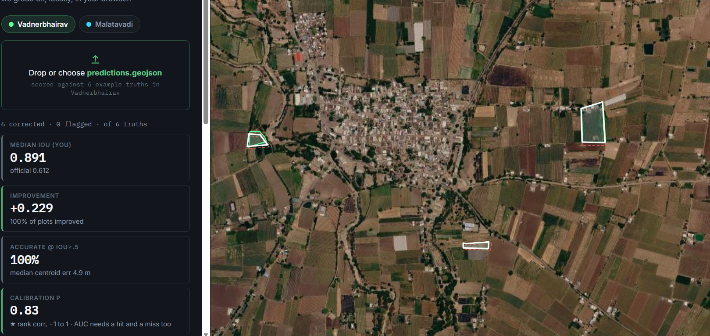
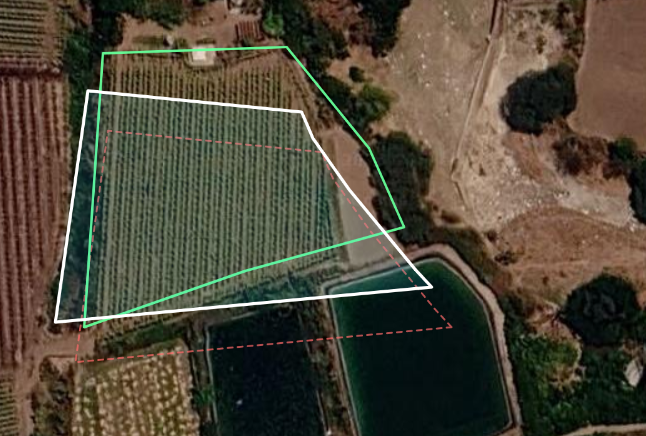
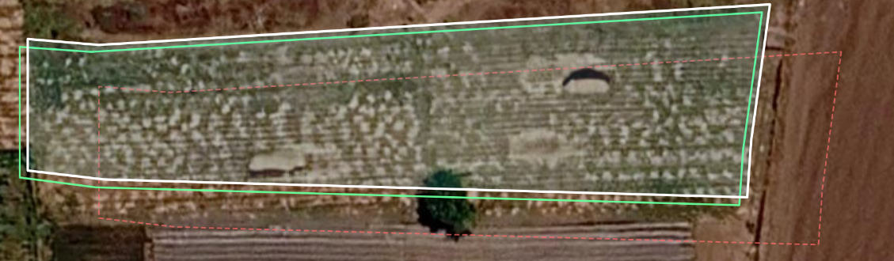
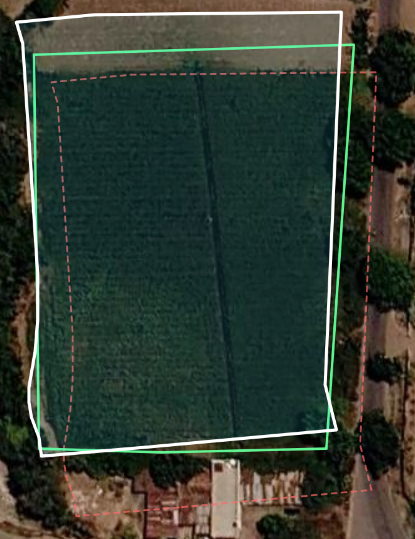
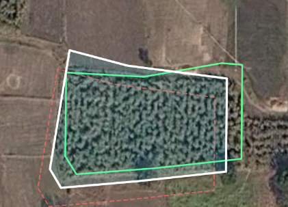
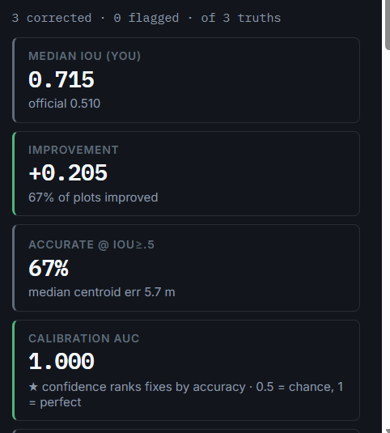
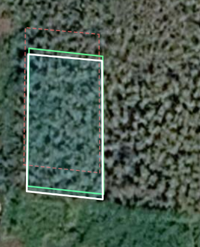
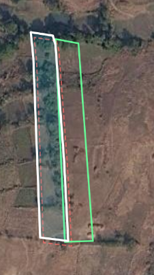

# BhuMe Boundary Alignment

This project corrects shifted cadastral plot boundaries using the satellite imagery
provided in each village bundle.

The official plot outline is often close in shape, but it may sit a few metres away from
the real field. My solution tries to move only the plots where there is enough image
evidence, and flags the rest instead of forcing a bad correction.

## What To Upload On The Test Page

Upload the generated `predictions.geojson` for the village you are testing.

```text
data/34855_vadnerbhairav_chandavad_nashik/predictions.geojson
data/12429_malatavadi_chandgad_kolhapur/predictions.geojson
```

Do not upload `input.geojson`, `imagery.tif`, `boundaries.tif`, or
`example_truths.geojson`.

## Problem In Simple Terms

The input boundary comes from old cadastral maps. The satellite image shows where the
field actually is today. For each plot, the program must decide:

```text
official boundary + satellite image
              |
              v
Can I place this plot confidently?
              |
       +------+------+
       |             |
       v             v
 corrected        flagged
 move geometry    keep original geometry
 add confidence   no confident move
```

The important part is judgement. A useful method should improve clear plots while avoiding
overconfident moves on unclear plots.

## Inputs And Outputs

Expected village folder:

```text
data/<village_name>/
  input.geojson          official plot boundaries
  imagery.tif            satellite imagery
  boundaries.tif         rough field-edge hints
  example_truths.geojson public examples for self-scoring
  predictions.geojson    generated output
```

Output feature format:

```text
plot_number   same plot id as input
status        corrected or flagged
confidence    0 to 1 for corrected plots
method_note   short explanation
geometry      moved boundary, or original boundary if flagged
```

All GeoJSON geometry stays in EPSG:4326 lon/lat.

## System Architecture

```text
+-------------------+       +--------------------+
| input.geojson     |       | imagery.tif        |
| official plots    |       | satellite pixels   |
+---------+---------+       +----------+---------+
          |                            |
          |                            v
          |                 +--------------------+
          |                 | Edge extraction    |
          |                 | image gradients    |
          |                 | + boundary hints   |
          |                 +----------+---------+
          |                            |
          v                            v
+------------------------------------------------+
| boundary_alignment/                            |
|                                                |
|  1. align.py                                   |
|     slide each outline over nearby edge target |
|                                                |
|  2. field.py                                   |
|     estimate local village drift from          |
|     confident plot matches                     |
|                                                |
|  3. pipeline.py                                |
|     re-solve with drift prior, compute         |
|     confidence, decide corrected or flagged    |
+-----------------------+------------------------+
                        |
                        v
              +----------------------+
              | predictions.geojson  |
              | corrected + flagged  |
              +----------------------+
```

## Method Flow

```text
+-------------+
| Load bundle |
+------+------+
       |
       v
+------------------------------+
| Convert plot geometry to     |
| imagery coordinate space     |
+--------------+---------------+
               |
               v
+------------------------------+
| Read raster patch around     |
| each plot                    |
+--------------+---------------+
               |
               v
+------------------------------+
| Build edge target            |
| Sobel image edges + hints    |
+--------------+---------------+
               |
               v
+------------------------------+
| Chamfer alignment            |
| find best translation        |
+--------------+---------------+
               |
               v
+------------------------------+
| Estimate smooth local drift  |
| from confident plot matches  |
+--------------+---------------+
               |
               v
+------------------------------+
| Re-align with drift prior    |
| for ambiguous plots          |
+--------------+---------------+
               |
               v
+------------------------------+
| Score confidence             |
| edge fit, contrast, drift    |
| agreement, edge density      |
+--------------+---------------+
               |
               v
+------------------------------+
| Write predictions.geojson    |
+------------------------------+
```

## Why This Approach

From the public example truths, the main error looked like a position shift rather than a
shape error. So I kept the official outline rigid and focused on finding the best
translation.

The method uses:

- satellite imagery as the main evidence;
- `boundaries.tif` only as a rough hint;
- chamfer matching to place outlines on visible edges;
- a local drift field because neighbouring plots usually drift in similar directions;
- confidence scoring to avoid claiming uncertain corrections.

## Confidence Meaning

Confidence is not a random score. It is based on:

```text
edge fit        does the moved outline sit close to visible field edges?
match contrast  is this shift clearly better than other nearby shifts?
drift agreement does it agree with nearby confident plots?
edge density    was there enough image evidence in the patch?
```

Low-confidence plots are flagged and kept unchanged.

## Project Layout

```text
boundary_alignment/        core correction method
  align.py                 chamfer edge matching
  field.py                 local drift estimation
  geo.py                   raster and CRS helpers
  pipeline.py              end-to-end prediction logic

bhume/                     starter-kit helpers for loading, writing, scoring
data/                      village folders and generated predictions
tools/                     optional analysis and visualization scripts
transcripts/               AI-use notes and transcript placeholders

generate_predictions.py    generate predictions.geojson
score_predictions.py       self-score existing predictions
validate_predictions.py    validate prediction file contract
geospatial_environment.py  PROJ/GDAL environment guard
```

## Setup

Install dependencies with `uv`:

```bash
uv sync
```

On Windows, if `uv` has cache permission issues, use local cache folders:

```powershell
$env:UV_CACHE_DIR="$PWD\.uv-cache"
$env:UV_PYTHON_INSTALL_DIR="$PWD\.uv-python"
```

## Run The Full Pipeline

Generate predictions for both villages and score against the public examples:

```bash
uv run generate_predictions.py --all --score
```

Run one village:

```bash
uv run generate_predictions.py data/34855_vadnerbhairav_chandavad_nashik --score
```

## Validate And Score Existing Predictions

These commands do not recompute the image alignment. They check the already generated
`predictions.geojson` files.

```bash
uv run score_predictions.py
uv run validate_predictions.py
```

## Current Public Example Results

```text
Vadnerbhairav
official median IoU: 0.612
predicted median IoU: 0.891
public examples improved: 6/6

Malatavadi
official median IoU: 0.510
predicted median IoU: 0.715
public examples improved: 2/3
```

These are only public sample checks. The real test is whether the same method generalizes
to hidden plots and whether confidence ranks good corrections above bad ones.

## Visual Results

The screenshots below show the generated output being scored and inspected on the public
test interface.

### Score Output

| Malatavadi | Vadnerbhairav |
|---|---|
|  |  |

### Vadnerbhairav Self-Score View

This view shows the uploaded `predictions.geojson` scored against the public example
truths. White is the prediction, green is the hand-checked truth, and red dashed lines are
the official starting position.



### Vadnerbhairav Alignment Examples

| Example 1 | Example 2 | Example 3 |
|---|---|---|
|  |  |  |

### Malatavadi Alignment Examples

| Example 1 | Example 2 | Example 3 | Example 4 |
|---|---|---|---|
|  |  |  |  |

## Known Limitations

- Thin or long plots can be hard because sliding along the long edge may look equally good
  in many positions.
- Tree cover, buildings, and weak image edges reduce confidence.
- Some plots may have a true area or shape mismatch. Translation alone is not the right
  fix for those cases.
- `boundaries.tif` can help, but it is not always reliable, so it is never treated as
  ground truth.

